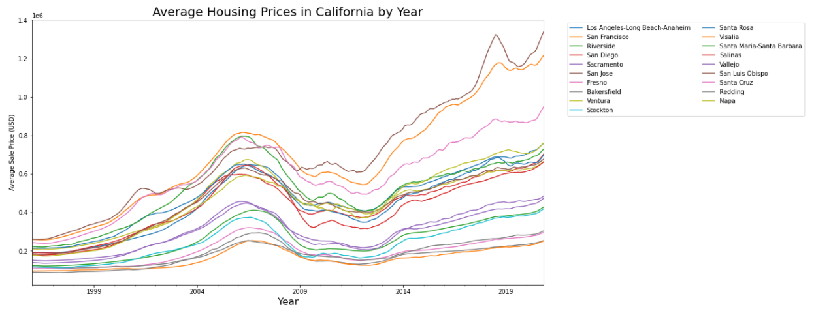
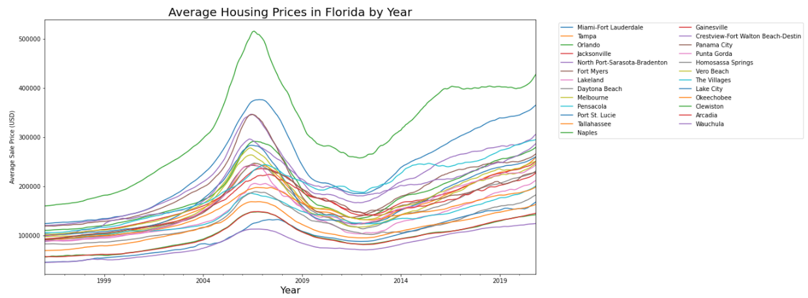
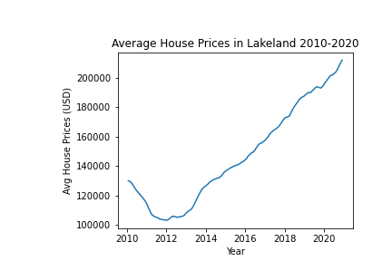
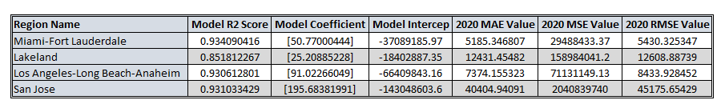
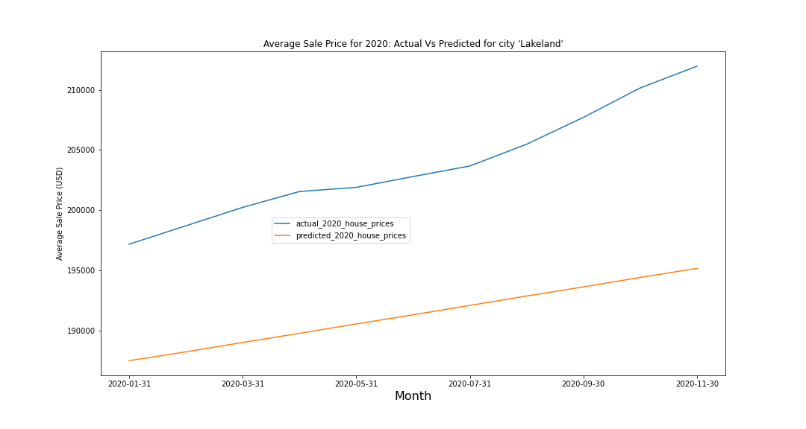

# End to End Machine Learning model to predict Housing Prices during COVID-19 

[Link to Github Pages](https://jopinson.github.io/COVID19_Property_Pandemic/) 
[Link to Google Slides](https://docs.google.com/presentation/d/1LOd4DVS-7EgPJrmVBYNyDwg0x_EM48Xhtd77qu3fqFc/edit#slide=id.p1) 
## Table of Contents
[Executive Summary](#executive-summary)  
[Tools and Technologies](#tools-and-technologies) 
[Data](#data)  
[Exploratory Data Analysis](#exploratory-data-analysis) 
[Machine Learning Model](#machine-learning-model)  
[Installation](#installation) 
[Folder Structure](#folder-structure) 
[Team](#team)  

## Executive Summary
After the housing market crash of 2007-2008, the house prices in the last decade rose steadily. And then came 2020. As the COVID-19 cases started spiking in late March, the local and state governments started lockdowns to control the spread of virus.  
With the businesses closed, there was a wide spread fear of another recession. So as part of this project we set out to answer following questions: 
1. Did Covid-19 cause prices to go up or down?
2. Did the amount of cases in the area affect the prices?
3. Were there any unusual trends in the data leading up to 2020?

 
To limit the scope of the project, we considered data from California and Florida states representing East and West Coast of United States. 
  
We decided to go with Linear Regression model as we saw a linear trend in the data set. The model produced R2 score (coefficient of determination) between 0.85 to .95 for the 4 regions we chose. Using the model we predicted the housing prices from January 2020 to Novemeber 2020 and we realized that:

1. COVID-19 didn't really impact the house prices much in the regions we chose. The predicted house prices tracked very closely to the actual house prices.
2. The concentration of COVID cases didn't have impact on housing prices. Whether a region had highest number of COVID cases or moderate number of COVID cases, the house prices tracked very closely to the predicted prices from Pre-COVID.

[back to ToC](#table-of-contents)
## Tools and Technologies
**Pandas** 
**SkLearn** 
**Numpy** 
**Tableau** 
**PostGres DB**  
[back to ToC](#table-of-contents)
## Data
### Data Source
The data was collected from following sources as of 11/30/2020.  
COVID Data - [https://www.kaggle.com/antgoldbloom/covid19-data-from-john-hopkins-university?select=RAW_us_confirmed_cases.csv](https://www.kaggle.com/antgoldbloom/covid19-data-from-john-hopkins-university?select=RAW_us_confirmed_cases.csv). This data file is downloaded [here](data/raw/covid/RAW_us_confirmed_cases.csv).  
Housing Data - [ZHVI All Homes (SFR, Condo/Co-op) Time Series, Smoothed, Seasonally Adjusted($) data for Metro & U.S](https://www.zillow.com/research/data/). This data file is downloaded [here](data/raw/zillow_data/Metro_zhvi_uc_sfr_tier_0.33_0.67_sm_sa_mon.csv)  

Since COVID data was aggregated by Counties and the Housing data was aggregated by Metro regions, we also needed city and county mapping data. This we obtained from free database from [https://simplemaps.com/data/us-cities](https://simplemaps.com/data/us-cities). The data file is downloaded [here](data/raw/uscities.csv).

### ETL Process
ETL code for all 3 raw data files can be reviewed [here](notebooks/ETL/). For all 3 raw data files, the code cleans and saves the processed data file in [data/processed](data/processed/) folder as well as loads the processed data to PostGres tables.  The details of the PostGres tables can be found [here](data/erd/ERD_Diagram.png).   
[COVID-ETL](notebooks/ETL/ETL-Covid.ipynb): 
The raw covid data file has covid cummulative numbers for each day from 1/1/2020 to 11/30/2020. As part of transformation process, following steps were performed -   
1. Filter the data for counties in California and Florida states only and removed unnecessary columns
2. The covid numbers were aggregated by month for each county 
3. The wide format was converted to long format.    

[Housing-ETL](notebooks/ETL/ETL-Housing.ipynb):  
The raw housing data file contained aggregated housing prices by month of each Metro region in US from 01/01/1996 to 11/30/2020. As part of transformation process, following steps were performed -  
1. Filter the data for metro regions in California and Florida states only and removed unnecessary columns.
2. The wide format was converted to long format
3. The metro region name contained two letter state code as well. The state code was removed from the region name.  

[city-county-mapping](notebooks/ETL/ETL_City_County_Map.ipynb): As part of ETL process for city county mapping, the unnecessary columns were removed from [uscities.csv](data/raw/uscities.csv).

[back to ToC](#table-of-contents) 
## Exploratory Data Analysis

Based on the below visualizations, following observations can be made: 
1. Los Angeles has the highest number of cases in CA. Santa Clara had the second highest cases in March but the spread was controlled slowly over following months.
2. Miami-Dade county has the highest numbers of cases in FL. Polk county started with low number of cases, but in the following months it saw increase in the COVID case numbers.
3. The housing market was at Peak during 2008. But once the market crashed it took some time for prices to stabilize. **Hence we are going to look at house prices only from 2010 - 2020 for our analysis and machine learning model training.**
4. House prices for Los Angeles, Miami Fort Lauderdale and Lakeland regions rose steadily from 2010 to 2020. 
5. San Jose house prices also rose steadily from 2010 to 2020, but the region saw a little dip in house prices in 2019.
### COVID Visualizations
Top 10 Counties in California with highest COVID cases  
  
Top 10 Counties in Florida with highest COVID cases  
  
### Housing Visualizations
 
 
 
 

**Average house prices from 2010 - 2020 in Los Angeles and Santa Clara (San Jose region) counties in California** 
Los Angeles | San Jose
--- | ---
 |  

**Average house prices from 2010 - 2020 in Miami-Dade and Polk (Lakeland region) counties in Florida** 
Miami - Fort Lauderdale | Lakeland
--- | ---
 |  

[back to ToC](#table-of-contents) 
## Machine Learning Model
The dataset that we had for housing data contained only dates and average housing prices from 1996-2020 for regions across USA. Since, the goal was to predict the 2020 housing prices and compare the predicted price with actual price we went with UniVariate Linear Regression model.  
The feature of our model is the Monthly dates and the target is average house prices.  
We are using R2 score as the goodness-of-fit measure for our Linear Regression model. 
We are also obtaining MAE, MSE and RMSE values for Predicted House Prices for 2020. RMSE values can be used to compare future models against the current model. 
 
The machine learning model notebook can be found [here](notebooks/modeling/Covid-Housing-ML_Combined.ipynb).  
### Data Preprocessing
As part of Data Preprocessing, following steps were performed for each region:
1. The Training Data was built by filtering dates between 1/1/2010 and 12/31/2019 
2. The SkLearn train_test_split method was used to split the training data into train and test sets.
3. The 2020 house prices are separated into a different dataset. This will be used for Predicting the 2020 Housing prices and then comparing with actual house prices.
4. The Date feature was converted to Ordinal values to feed into the model.

### Predictive analysis and visualization
**Model Metrics**
  

**Actual Vs Predicted Pricses of Selected Regions in California and Florida** 
 
 
 
 
 

[back to ToC](#table-of-contents) 
## Installation
### Prerequisites

1. Python 3.8.5
2. PostGres DB (pgAdmin 4.24)
  

### Activate conda environment
conda create -name CovidHousing python=3.8 
conda activate CovidHousing
  

### One Time Setup
1. Clone the git repo = <project_root_folder>
2. create `config.py` under project_root_folder; add db_password = <your_postgres_db_password> to file and save.  
3. Start the pgAdmin server
4. pip install -r requirements.txt
5. Run python init_db.py
  

### Run

Run python files in the following order:
1. python etl_data.py
2. python join_tables.py
3. python ml_model_train.py 
    a. The graphs from the model are saved in [images] folder 
    b. The results from the model are saved in csv files under [data/processed/](../data/prcessed/) 
    > i. [result metrics](../data/processed/model_metrics.csv) 
    ii. [2020 Actual Vs Predicted Prices](../data/processed/ml_2020_act_pred.csv) 
 

[back to ToC](#table-of-contents) 

### Folder Structure
- [data](data/) - Contains Raw data, Processed Data, ERDs and SQL Queries
- [models](models/) - Contains trained models
- [notebooks](notebooks/) - Contains notebooks for ETL, data preprocessing, modeling
- [reports](reports/) - Contains final presentation slides, HTML / PDF reports, images required for reports and README
- [images](images/) - Contains images required for index.html
- [html](html/) - Contains html code for embedding Tableau dashboards in index.html

[back to ToC](#table-of-contents)
## Team
We came together to code things a single programmer can't possibly code by themselves, we are Earth's Mightiest Coders! 
[Angela Silveira](https://github.com/Angela-Silveira) 
[Duane Conley](https://github.com/Duane93) 
[Harishawn Ramrup](https://github.com/ramruph) 
[Johnathon Pinson](https://github.com/Jopinson) 
[Nitu Singh](https://github.com/vnitusingh) 

