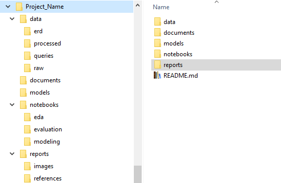
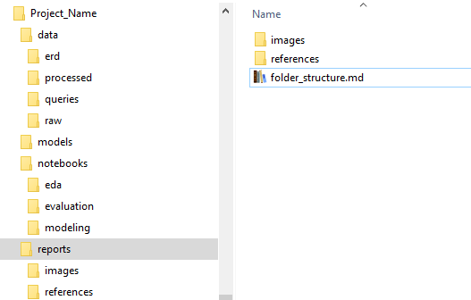

## Folder Structure

First Level Folder Structure: 
  
Second Level Folder Structure: 
 

### Data: Contains resources related to data

- <u>erd</u> : for ERD diagrams and images.
- <u>processed</u> : for processed data files that should be input for machine learning model.
- <u>queries</u> : for all the database queries to create Database, Tables and populating and processing data in Tables.
- <u>raw</u> : for all raw data collected for project like CSVs, JSON etc.
  
### Models: 
To save trained models (h5 files) and checkpoints, if saved.
 
 

### Notebooks:
- <u>eda</u> : notebooks files used for data pre processing and exploratory analysis. 
- <u>evaluation</u> : sdd
- <u>modeling</u> : notebooks modeling 
 
 
### Reports: Contains analysis reports and resources

- <u>images</u> : for images of graphs and figures to create reports.
- <u> references </u>: for documents and links used as references for reports.
- directly under Reports folder, the detailed project reports like slides, documents, README.md file
    

References:
1. [Managed your Data Science Project Structure](https://towardsdatascience.com/manage-your-data-science-project-structure-in-early-stage-95f91d4d0600)
2. [Cookie Cutter Data Science](https://drivendata.github.io/cookiecutter-data-science/) 